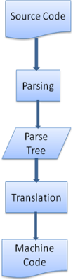
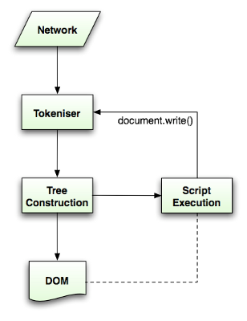

# 渲染引擎
渲染引擎的职责是，恩。。渲染，意味着在浏览器窗口上展示请求的内容。
默认情况下渲染引擎能展示HTML、XML文件和图片。通过插件（浏览器拓展）也可以展示其他类型。一个例子是通过PDF预览插件展示PDF文件。我们会在另外的章节讨论插件和拓展。在本章节我们专注于通过css样式控制来展示的html和图片。

## 渲染引擎
我们提及的浏览器-Firefox、Chrome、Safari是基于两种渲染引擎的，Firefox使用`Fecko` - 火狐自家的渲染器。Safari和Chrome都是使用`webkit`.webkit作为一个开源的渲染引擎，用在Linux平台，也被苹果公司修改使用在Mac和windows上。查看更多信息 http://webkit.org/。

## 主要的流程
渲染引擎开始于得到请求文档的内容，&&&this will usually be done in 8k chunks。

自那以后，下面这幅图片就是渲染引擎的基础工作流。


- 解析HTML去构建DOM树
- 渲染树构建
- 渲染树布局
- 绘制渲染树

渲染引擎开始解析得到的HTML文档，把tags标志&&&转变为DOM节点挂在一颗叫`内容树content tree`&&&上。这个过程会解析样式的信息，包括外加的css文件和内嵌的style属性。样式的信息跟html中视觉的指令合起来用来创建另一颗树-
`render tree 渲染树` &&&

render tree渲染树包含了一系列带着视觉上属性（颜色、大小）的长方块。这些长方块按顺序被展示在屏幕上。

渲染树构建好以后就进入`布局layout`阶段了。这意味着该给每个节点设置显示在屏幕上的正确坐标了。下一个阶段是`painting 绘制`。渲染树render tree将被遍历然后每个机电会通过UI backend layer绘制在屏幕上。

理解这些过程是很缓和逐渐的是很重要的，为了更好的用户体验，渲染引擎rendering engine 会尽可能快的讲内容展示在屏幕上，它不会等待所有的HTML都被解析完才去构建渲染树和布局，一部分内容会先被解析和展示，而这个过程（上述的1234）会一直持续，随着源源不断来自网络的内容。


从上面的两幅图比较就可以看出`webkit`跟`Geoko`有一些术语上的区别，整个流程基本上是一致的。Geoko把样式格式化后的元素的tree定义为 - `Frame tree 结构树`，每一个元素是一个结构frame ，webkit使用render tree 渲染树的术语，渲染树包含一系列render对象。webkit使用`layout布局`描述元素的位置定位，而Geoko称这为Reflow。`Attachment`是一个webkit术语用来描述结合DOM节点DOM nodes和样式信息去生成rendertree渲染树。一个小的非语义上的不同是Geoko有一个在HTML跟DOMtree之间额外的层-`content sink`,这是个工厂用来制造dom元素。我们会详细的讲解每个过程。

## 解析、dom树的构建

### 解析总览 Parsing general
parsing解析在渲染引擎中是个非常中要的过程，我们会深挖一点，我们先看点简单的解析parsing介绍。

解析文档意味着把这个文档解释为一些说的通的结构，一种代码能读得懂可以用的结构。解析的结果通常是展示文档结构的nodes节点构成的树。这被称为
`解析树parse tree`或者`句法分析树 syntax tree`。

例子：解析 表达式 `2 + 3 -1` 会返回这个树


**语法**</br>
解析是以文档遵守的句法规则为基础的，这些规则是这个文档的语言或格式。任何一种可以解析的格式必须确定的包含词汇和句法分析的语法。这被称为 `context free grammar`&&& 。人类语言不是这样一种语言，所以不能被传统的解析技术解析。\

**分析器 Parser ** -词法分析程序的结合</br>
解析可以被拆解成两个副进程。
- 词汇的分析 lexical analysis
- 句法的分析 syntax analysis

词汇分析是一个拆解内容变成`token`符号的过程。`tokens`是语言的词汇，合法的一些小块的集合&&&，在人类语言中这包含了所有出现在字典中的单词。
句法分析由语言句法规则应用。

分析器通常将工作分成两个组件，`lexer 有时候也叫tokenizer 词汇分析程序` 负责打碎内容变成合法的`tokens`，`paser 句法分析程序`负责根据语言句法规则分析文档结构并把文档结构解析成`parse tree解析树`。`lexer`知道怎么除去不相干的东西好比空格跟回车。


解析的过程是迭代的&&&iterative，解析器（parser）总是会向词汇分析器（lexer）要新的token，然后尽力根据句法规则去匹配，如果匹配了，一个相等于token的node节点会被加到parsetree中，然后解析器parser会迭代下一个token。
如果没有语法规则被匹配到，parser会把token存到本地，and keep asking for tokens until a rule matching all the internally stored tokens is found&&&，如果没有句法规则被找到那么parser会发起一个意外提示，这意味着文档是不合法的并且包含了句法上的错误。

**转变**</br>
在大多数情况下，parse tree不是最终的产物，解析被用于翻译，把输入的文档转换成另外一种形式。好比汇编，编译器把源代码编译成机器读的懂的代码。首先把输入的文档解析成parse
tree，然后编译成机器读得懂的代码文档。


**解析的一个例子**</br>
在上文 我们模拟了一次数字加减表达的parse。让我们定义一个简单的数学语言并看看解析的过程&&&

词汇vlcabulary： 我们的语言包含了integers、plus signs、minus signs。

句法规则: &&&
- 语言的句法规则构件有公式 术语 操作符
- 我们的语言能包含公式内的任何数字
- 公式定义 由“term”跟随操作符再跟随着“term”
- 操作符是加号或减号
- “term”术语，是一个整数token或者一个公式

我们来分析输入`2 + 3 -1`.
根据第五条，第一个匹配句法规则的字符是"2"，根据第三条，term跟随操作符再滚岁term，第二个匹配的是"2 + 3"，第三个匹配的是"2 + 3 -1"，因为我们已经知道"2 + 3"已经是一个公式了，根据第5条可以作为一个term，这样"2 + 3" - 1 也就符合第三条了。
所以说"2 + +"就不符合上面提到的规则。

**正式的词汇和句法规则的说明vocabulary syntax**</br>
词汇通常通过正则表达式表示。

举个例子我们上边定义的语言会如此定义：<br>
```
INTEGER :0|[1-9][0-9]*
PLUS : +
MINUS: -
```
正如你所看到的，integers被正则表达式定义。

句法分析Syntax一般在一种叫[BNF](https://en.wikipedia.org/wiki/Backus%E2%80%93Naur_Form)的格式中被定义，我们的语言将被如此定义：
```
expression :=  term  operation  term
operation :=  PLUS | MINUS
term := INTEGER | expression
```
我们上面讲过如果一种语言的语法是一种`context frees`语法，那么这个语言才能被解析器解析。关于`context free`语法，一种直观的解释就是这个语法可以完全在BNF这种格式下表达。官方的解答可以看http://en.wikipedia.org/wiki/Context-free_grammar

**解析器的种类**</br>
有两种基础的解析器，一种叫自上而下解析器`top down`，还有一种叫自下而上解析器`bottom up`。
直白的解释是，自上而下及解析器从上层句法规则开始然后去匹配。自下而上解析器从输入的内容开始逐渐转变成句法规则，从低等级的规则开始知道高等级的规则。&&&

自上而下解析器从最高级的规则开始，还是上面这个例子，它会将"2 + 3"作为一个公式，然后将 ”2 + 3 -1" 作为一个公式，辨认公式的过程也需要其他规则，但最关键的点还是最高层的规则。

自下而上解析器会扫描输入的内容直到找到匹配的规则，然后用这个规则替换掉这个字符。这样的过程会持续到最后一个输入内容。被匹配的公式会被放置在解析器的栈中。

<table>
  <tr><th>Stack</th><th>Input</th></tr>
  <tr><td>&nbsp;</td><td>2 + 3 - 1</td></tr>  
  <tr><td>term</td><td> + 3 - 1</td></tr> 
  <tr><td>term operation</td><td> 3 - 1</td></tr>
  <tr><td>expression</td><td>- 1</td></tr> 
  <tr><td>expression operation</td><td>1</td></tr> 
  <tr><td>expression</td><td>&nbsp;</td></tr>              			                          
</table>	 

这种类型的解析器被称为移动减少解析器，因为输入的内容一直在往右移（想象一根指头在input上从左往右移动），并且消失的那些都变成了句法规则。

**自动生成语法分析程序parser**</br>
这有些工具可以生成语法分析器（解析器），他们被称为解析器生成器，注入语言的语法-词汇和句法规则然后他们就会生成一个解析器。写一个解析器需要深刻理解解析过程，所以手写写一个高性能的解析器是不容易的，所以解析器生成器是非常有用的。

webkit使用两种著名的解析器生成器，
- Flex 创造一个lexer词汇分析器
- Bison 创造一个paser 句法分析器
（你可以用Lex和Yacc的名字去结合他们）


Flex 的输入是一个包含tokens的正则表达式的定义。
Bison的输入是BNF格式的语言句法规则。

### HTML Parser html的解析器
HTML解析器的作用是把html文档标记解析成`parse tree`

#### html语法的定义
html文档的词汇和句法规则由w3c组织制定的规范所定义。目前的版本是HTML4,HTML5正在制定中（译者注：HTML5已经发布）

#### 并不是`context free grammar`
我们从上文的解析parsing介绍可以知道，语法可以使用类似BNF的格式去定义。但不幸的是所有常规的解析器并不支持HTML的解析（我没有开玩笑，这些解析器用来解析css和javascript）。
HTML不能轻易地被定义成解析器需要的`context free` 语法。
有一种正式的定义HTML的格式- DTD（Document Type Definition）- 但这不是`context free 语法`。
看上去非常奇怪 - HTML跟XML长的很相似。市面上有很多可用的XML解析器。有一种THML的XML形式的变种 - XMTML。那么这些形式之间最大的不同是什么呢？
不同点在于HTML更加的`“宽松”`。它允许你忽略一些隐式添加的标签，有时候可以忽略开头的标签，或者结尾的标签。大体上来讲这是一个温和的语法，不同于XML的呆板高要求的语法。
显然这看起来很小的一个区别却成就了HTML和XML的所有不同。一方面来讲这是HTML如此成果的一个原因，它忽略认为的错误对开发者更友好，但另一方面，书写格式化的语法也是困难的。所以总结来讲HTML不是很容易的被解析。由于它的语法不是`context free grammar`所以不会被传统的解析器解析，当然也不会被XML解析器解析。

#### HTML DTD
HTML的定义是基于DTD格式的。这种格式用来定义[SGML](https://en.wikipedia.org/wiki/Standard_Generalized_Markup_Language)Standard Generalized Markup Language家族的语言。格式包含了所有被允许的元素属性等级的定义。正如我们前面了解的，HTML DTD不是来自`context free grammar`。

有几个DTD格式的变种，严格模式确保唯一的一种规范。但是其他模式包含一些浏览器所需要的标记的支持。目的是为了向后兼容。目前严格模式的DTD在http://www.w3.org/TR/html4/strict.dtd

#### DOM
输出的树-parse tree 是一个包含了dom元素和属性节点的书。DOM是Document Object Model的简称。这是HTML文档的对象展示，HTML元素对外界的界面展示，跟javascript的接口一样。
DOMtree的根节点是`document`对象。

DOM对于标记 几乎有一对一的对应关系。举个例子：这个标记：
```
<html>
	<body>
		<p>
			Hello World
		</p>
		<div> </div>
	</body>
</html>
```
会被转换为如下dom树。

跟HTML一样，DOM也是由w3c组织制定的，http://www.w3.org/DOM/DOMTR。
这是操作文档的通用详述文档，具体的模块描述具体的HTML元素。
当我说一棵树包含着dom节点，我的意思是这颗树是被实现了dom接口之一的元素构成。Browsers use concrete implementations that have other attributes used by the browser internally

#### 解析算法
正如我们上文看到的，HTML无法使用从上到下或从下到上的解析方式。

理由如下：
- 语言宽松的本质
- 浏览器有传统的容错能力支持众多不和规范的HTML。
- 解析的过程是会中断又进行的&&& 通常情况下来源内容在解析的过程中是不会变的，但是HTML中，script变迁持续的`document.write`会增加额外的tokens，所以解析的过程通常会修改输入&&&

因为不能够使用常规的解析技术，浏览器为解析HTML创建了定制版的解析器。

解析算法在HTML5规范中有详细的描述。这个算法包含了两个步骤-符号化和树的构建。

符号化是将输入解析成tokens的词法分析过程。HTML的tokens包括开始标签，结尾标签，属性名字和属性值。

标记生成器会识别token，把这个token给到树构造器里，然后为了识别下一个token消耗下一个输入的字符，持续这样的过程直到输入的结束。



#### 符号化算法
符号化算法的输出是HTML token。算法表示为状态机。每个状态消耗一个或多个输入流中的字符然后根据这些字符更新下一个状态。结果受当前符号化的状态和树的构建的状态所影响。这就意味着相同的被消耗的字符会根据当前的状态对下一个适合的状态产生不同的影响。

基础例子 符号化以下HTML
```
<html>
  <body>
    Hello world
  </body>
</html>
```
最初始的状态是`Data state`。当遇到`<`符号时，状态被更改为`(标签被打开)Tag open state`，消耗一个'z-a'的字符引起了`开始标签token（Start tag token）`的创建，状态被更改为`Tag name state`。这个状态会持续直到`>`符号被消耗。每个符号（译者注：不是字母）都会被追加新的token名字，在我们的例子里被创建的token是一个`html`token。当到达`>`符号时，当前的token被释放然后状态重新变为`Data state`。`<body>`标签跟之前的步骤一样被执行。


